# Unity-Shader-Basics-Tutorial
### By Adam Leung (www.adamleung.me)

> Check out my favourite code snippets for Unity [here](https://github.com/Centribo/Useful-Unity-Assets) and my favourite Unity packages [here](https://github.com/Centribo/Centribo-Awesome-Unity)!

Welcome, this tutorial is supposed to be a gentle introduction into writing shaders for Unity. It assumes you have some previous knowledge in working with Unity but have never touched shaders or materials.

We'll be building up the shader in parts, stopping along the way to show what everything does.

> If you have any improvements, suggestions, or spot any mistakes, please contact me!

## Part 1: What's a Shader?

Shaders are part of the computer graphics rendering pipeline. They're small applications that tell the computer how to render and shade objects in a scene. This includes calculating the color and light values for a given object so that it can be shown on screen. Ontop of that, shaders are used to create many of the special and post-processing effects that you see in games today. 

In modern game engines, (Including Unity) shaders run in a programmable GPU (Graphics Processing Unit) rendering pipeline, which allow them to run in parallel and do many shader calculations very quickly.

Wikipedia has a great article about shaders [here.](https://en.wikipedia.org/wiki/Shader)

## Part 2: The Rendering Pipeline

For our purposes, we'll simplify the rendering pipeline. Here's an image showing what we'll discuss in this tutorial:

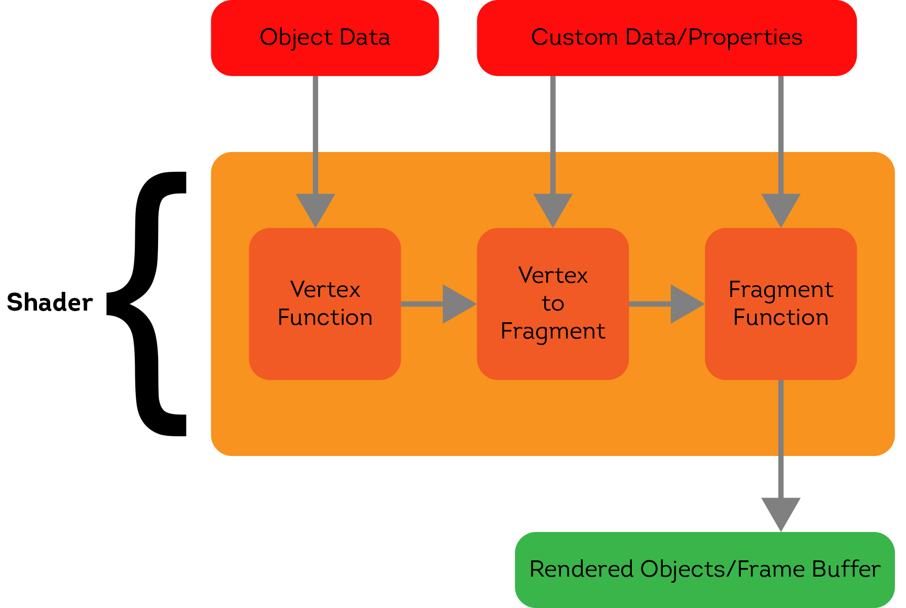

I like to think of shaders as programs that transform one type of information (model data, colours, etc.) to another type of information (pixels/fragments). Object data is data that is inherit to the object. Things such as points in the model, normals, triangles, UV coordinates, etc. Custom Data/Properties are things that we can pass into a shader to use. Things such as colours, textures, numbers, etc.

The first step of the shader pipeline is the vertex function. Vertices, as you might know, are just points in 3D space. The vertex function will work with the vertices in the model (Along with other data such as normals) and prepare them for the next step, the fragment function.

The fragment function will take in vertices and shade them in. Think of it like a painter and their paint brush. It ultimately outputs pixel data, in a (R, G, B, A) format.

Lastly, the pixels are pushed to a frame buffer, where they may be manipulated further (even by other shaders!) until they are drawn on screen.

## Part 3: Scene Setup

So before we start writing some shader code, let's setup our scene. Create a new project in Unity, and import all the assets:

* [Bowl model](./Assets/Models/Bowl.blend)

* [Noise texture](./Assets/Textures/Noise.png)

* [Bowl texture](./Assets/Textures/Bowl.png)

Add a cube, a sphere, and the bowl model to a new scene and save the scene. Here's what your scene should look like after:

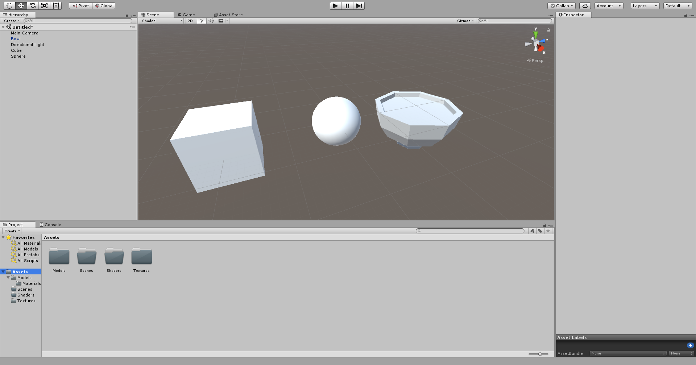

Next, right click in the Project view (Or go to Create) and add a new Unlit Shader. We'll call it "Tutorial_Shader" for now.

*If you're curious about the other kinds of shaders, I'll talk about them at the near the end.*

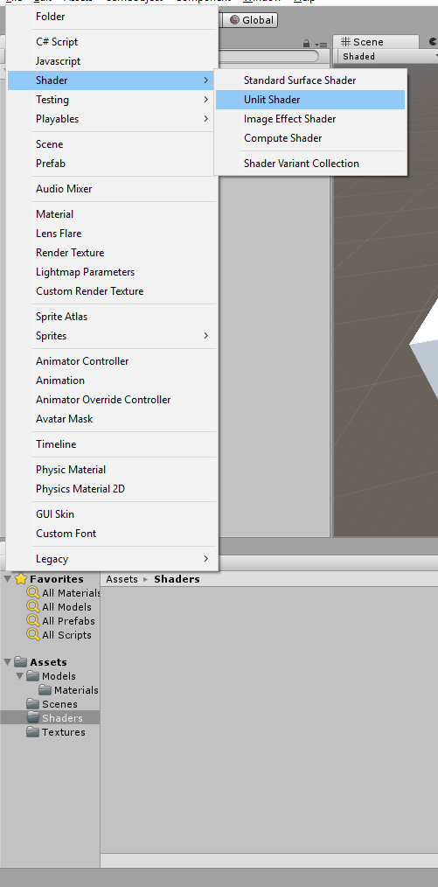

Then, right click the shader file we just made and go to Create > Material. Unity will automatically create a material that uses that shader with the correct name.

__Note: a "Material" in Unity is just a *instance* of a shader. It just saves the values & refences of the custom data/properties.__

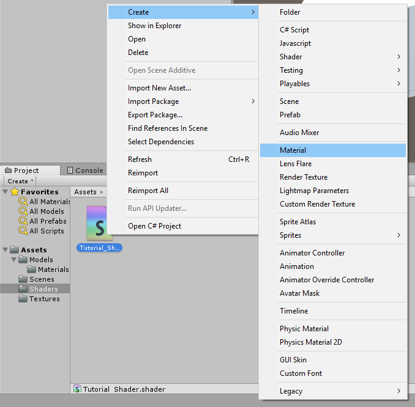

Lastly, apply the material to all the objects we've added to the scene by clicking and dragging them to each object.

Everything in the scene should look white and without shadows or shading, like this:

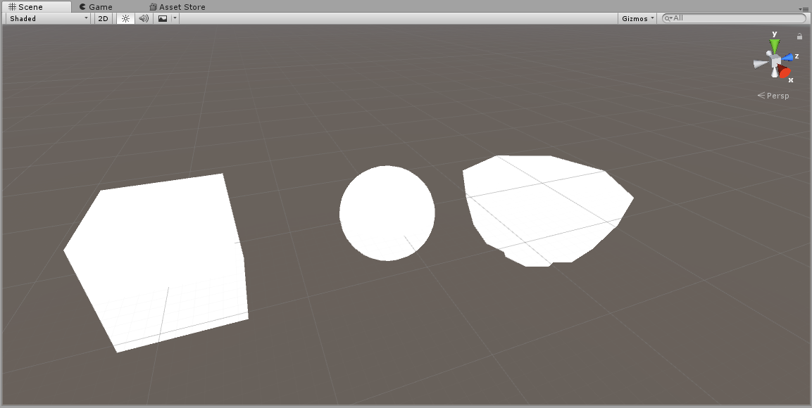

## Part 4: Skeleton of a Unlit Shader

Time to start writing our shader! Let's open our Tutorial_Shader.shader file we created before. You'll see Unity automatically generates some code for us to use/build off of. For the sake of this tutorial, delete all of this and make the .shader file blank. 

__Note: All shaders in Unity are written in language called "ShaderLab." Shaderlab is a wrapper for HLSL/Cg that lets Unity cross compile shader code for many platforms and expose properties to the inspector.__

To start we'll add this code:

```
Shader "Unlit/Tutorial_Shader" {
	...
}
```
These lines of code just specify where the shader code is. The string in quotes after the *Shader* keyword specify to Unity where you'll find the shader.

For example:
```hlsl
Shader "A/B/C/D/E_Shader" {
	...
}
```
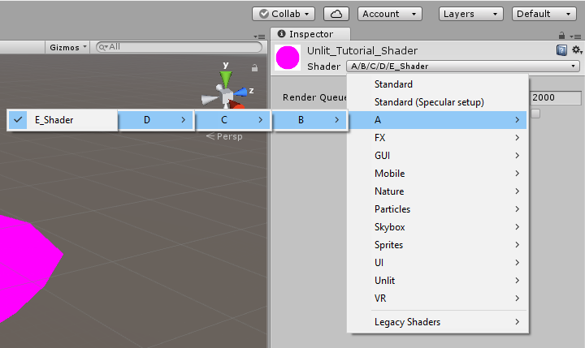

If you save your shader and switch back to Unity, you'll notice all our objects now are pink:

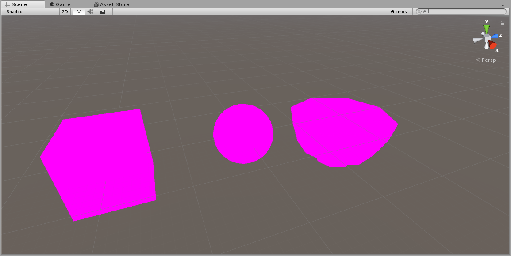

This is a fallback shader that Unity will use whenever your shader has errors in it. If you ever get pink objects, you can click on your shader file in the project window and look at the inspector to see the corresponding errors. For now, we'll have pink objects because we haven't completed our shader.

Next up is the properties block:

```
Shader "Unlit/Tutorial_Shader" {
	Properties {
		...
	}
}
```

The properties block is where we can pass in that custom data we were walking about before. Anything we declare here will be shown in the Unity editor for us to change and be exposed to scripting aswell.

Underneath our properties block we'll have our subshader:

```
Shader "Unlit/Tutorial_Shader" {
	Properties {
	}

	SubShader {
		...
	}
}
```

Every shader has one or more subshaders. If you're deploying to multiple platforms it can be useful to add multiple subshaders; For example, you might want two subshaders, one of higher quality for PC/Desktop and one of lower quality but faster for mobile.

Then we have our pass:
```
Shader "Unlit/Tutorial_Shader" {
	Properties {
	}

	SubShader {
		Pass {
			...
		}
	}
}
```
Each subshader has atleast one pass, which is actually where the object gets rendered. Some effects require having multiple passes, but we'll just focus on one for now.

Within our pass, we have the actual rendering code block:
```
Shader "Unlit/Tutorial_Shader" {
	Properties {
	}

	SubShader {
		Pass {
			CGPROGRAM
				...
			ENDCG
		}
	}
}
```
Anything within CGPROGRAM and ENDCG is where we actually write our shading code. For Unity this is a variant of HLSL and CG shading languages.

Next, we'll tell Unity what our vertex and fragment functions are:
```
CGPROGRAM
	#pragma vertex vertexFunction
	#pragma fragment fragmentFunction
ENDCG
```
Here, we're saying we have a vertex function called "vertexFunction", and a fragment function called "fragmentFunction"".

We'll define those functions aswell:
```
CGPROGRAM
	#pragma vertex vertexFunction
	#pragma fragment fragmentFunction

	void vertexFunction () {

	}

	void fragmentFunction () {

	}
ENDCG
```
Before we start shading, we need to setup some data structures and our two functions in a way so that we can take in Unity's given data and give data back to Unity. First, we'll include *UnityCG.inc*. This file includes a number of helper functions that we can use. If you want a full list of them, you can go [here.](https://docs.unity3d.com/Manual/SL-BuiltinFunctions.html)

We'll also add a data structure called *appdata*, and modify our vertex function so that it takes in an appdata structure:

```
CGPROGRAM
	#pragma vertex vertexFunction
	#pragma fragment fragmentFunction

	#include "UnityCG.cginc"

	struct appdata {

	};

	void vertexFunction (appdata IN) {

	}

	void fragmentFunction () {

	}
ENDCG
```
When we give Unity an argument to call the vertex function with, it will look into the structure of that argument (in this case, our *appdata* structure) and attempt to pass in values to it based on the model that is being drawn. We can define data that we want Unity to pass in by declaring variables like this:

```
[type] [name] : [semantic];
```
So for example, we can ask Unity for the positions of the vertices of this model like this:
```
float4 vertex : POSITION;
```
For now we'll ask Unity to give us the position of the vertices and the coordinates of the UV like so:
```
struct appdata {
	float4 vertex : POSITION;
	float2 uv : TEXCOORD0;
};
```
If you want to learn more about providing vertex data to vertex functions, you can read [here.](https://docs.unity3d.com/Manual/SL-VertexProgramInputs.html)

Lastly for the vertex function setup, we'll create one more struct called *v2f* (which stands for vertex to fragment) that will contain the data we'll be passing into our fragment function. We'll also make sure our vertex function returns data of this struct and create and return a blank one while we're at it:
```
CGPROGRAM
	#pragma vertex vertexFunction
	#pragma fragment fragmentFunction

	#include "UnityCG.cginc"

	struct appdata {
		float4 vertex : POSITION;
		float2 uv : TEXCOORD0;
	};

	struct v2f {
	};

	v2f vertexFunction (appdata IN) {
		v2f OUT;

		return OUT;
	}

	void fragmentFunction () {

	}
ENDCG
```
Just like before we can define some data in v2f that we want to pass from our vertex function to our fragment function.
```
struct v2f {
	float4 position : SV_POSITION;
	float2 uv : TEXCOORD0;
};
```
*If you're curious about SV_POSITION vs POSITION, SV stands for "system value" and represents in our v2f struct that this will be the final transformed vertex position use for rendering.*

Okay we're almost ready, we just need to edit our fragment function. First, we'll modify it to take in the v2f struct and make it return a *fixed4* value:
```
fixed4 fragmentFunction (v2f IN) {

}
```
Our output for the fragment function will be a colour represented by (R, G, B, A) values, hence the output of this function being a *fixed4*.

Lastly, we're going to add an output semantic SV_TARGET to our fragment function like so:
```
fixed4 fragmentFunction (v2f IN) : SV_TARGET {

}
```
This tells Unity that we're outputting a fixed4 colour to be rendered.
We're now ready to start actually coding the meat and potatoes of our vertex and fragment functions!
Here's our basic skeleton that we've made up to this point:
```
Shader "Unlit/Tutorial_Shader" {
	Properties {
		
	}

	SubShader {
		Pass {
			CGPROGRAM
				#pragma vertex vertexFunction
				#pragma fragment fragmentFunction

				#include "UnityCG.cginc"

				struct appdata {
					float4 vertex : POSITION;
					float2 uv : TEXCOORD0;
				};

				struct v2f {
					float4 position : SV_POSITION;
					float2 uv : TEXCOORD0;
				};

				v2f vertexFunction (appdata IN) {
					v2f OUT;

					return OUT;
				}

				fixed4 fragmentFunction (v2f IN) : SV_TARGET {

				}
			ENDCG
		}
	}
}
```

## Part 5: Shading basics

First thing we'll do is get the correct positions of the vertices. We'll do this using a function called UnityObjectToClipPos() like so:
```
v2f vertexFunction (appdata IN) {
	v2f OUT;

	OUT.position = UnityObjectToClipPos(IN.vertex);

	return OUT;
}
```
What this function does is take a vertex that is represented in local object space, and tranforms it into the rendering camera's clip space. Notice we're passing along the transformed point by setting OUT.position's value. If you want to learn more about this, [here](https://learnopengl.com/Getting-started/Coordinate-Systems) is a great discussion on what these spaces are and their purposes.

Next, we'll make our fragment function return a solid green colour: 
```
fixed4 fragmentFunction (v2f IN) : SV_TARGET {
	return fixed4(0, 1, 0, 1); //(R, G, B, A)
}
```
And now, the moment you've been waiting for! Save your shader and return to Unity and you'll see our beautiful green objects!

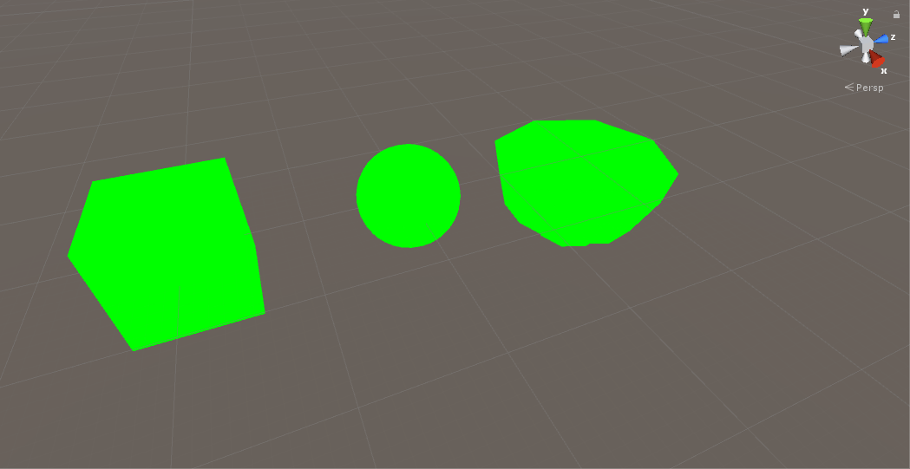

Okay, this probably not that impressive to you, so lets keep building. How about, instead of returning a basic green colour, we edit our shader to return any colour we want? What we'll need to do to achieve this is start working with custom properties.

We can add the properties in the *Properties* block we want to use by following this syntax:
```
name ("display name", type) = default value
```
So for example, we'll expose a colour value like so:
```
Properties {
	_Colour ("Totally Rad Colour!", Color) = (1, 1, 1, 1)
}
```
Here we're defining a colour for us to use, called *_Colour* and it will be shown as "Totally Rad Colour!" in the Unity inspector. We're also giving it a default value of white.
If you save and return to Unity now, when you inspect the material, you should see this:

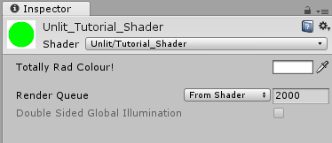

Before we can use this colour, we need to actually pass it into the CG code. Unity does this automatically by binding it by variable name like so:

```
CGPROGRAM
	#pragma vertex vertexFunction
	#pragma fragment fragmentFunction

	#include "UnityCG.cginc"

	struct appdata {
		float4 vertex : POSITION;
		float2 uv : TEXCOORD0;
	};

	struct v2f {
		float4 position : SV_POSITION;
		float2 uv : TEXCOORD0;
	};

	// ****************************
	//Get our properties into CG
	// ****************************
	float4 _Colour;

	v2f vertexFunction (appdata IN) {
		v2f OUT;
		OUT.position = UnityObjectToClipPos(IN.vertex);
		return OUT;
	}

	fixed4 fragmentFunction (v2f IN) : SV_TARGET {
		return fixed4(0, 1, 0, 1);
	}
ENDCG
```
*I like to put properties after my structs to keep my code organized, but you can put it anywhere so long as its in the top scope of the CGPROGRAM*

We can now use our _Colour value in our fragment function. Instead of returning that green, lets just return whatever colour we want:
```
fixed4 fragmentFunction (v2f IN) : SV_TARGET {
	return _Colour;
}
```
And now, we can save and return to Unity. If you inspect the material and start changing our colour value, you should see all the colours of the objects change accordingly!

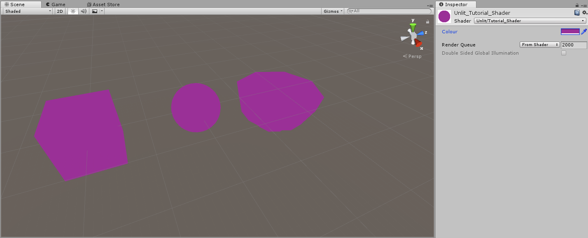

Since we now know how to add properties, lets try adding a standard texture map. We'll need a new property for our texture:

```
Properties {
	_Colour ("Colour", Color) = (1, 1, 1, 1)
	_MainTexture ("Main Texture", 2D) = "white" {}
}
```
Notice how it's of type *2D* (2D Texture), and we're defaulting to a blank white texture. We've also need to get the property into CG to use it:

```
float4 _Colour;
sampler2D _MainTexture;
```
Then, we need to give our fragment function the UV coordinates from the model. We can do this by going back to our vertex function and passing them into the v2f struct we return like so:

```
v2f vertexFunction (appdata IN) {
	v2f OUT;
	OUT.position = UnityObjectToClipPos(IN.vertex);
	OUT.uv = IN.uv;
	return OUT;
}
```
Now in order to use the colours from the texture for our fragment function, we need to *sample* it at certain points. Thankfully, CG has a function that does this for us, called *tex2D*.

```
fixed4 fragmentFunction (v2f IN) : SV_TARGET {
	return tex2D(_MainTexture, IN.uv);
}
```
tex2D takes in the texture (ie: sample2D) we want to sample, and the UV coordinate we want to sample with. In this case, we're providing it with our main texture and giving it the point on the model where we want to get the colour from, then returning that result as our final colour. Now, if you save and return back to Unity and inspect the material, we can select the bowl texture for our "Main Texture". You'll see the models update, and the bowl model in particular (the model the texture was made for) should look like a bowl of soup!

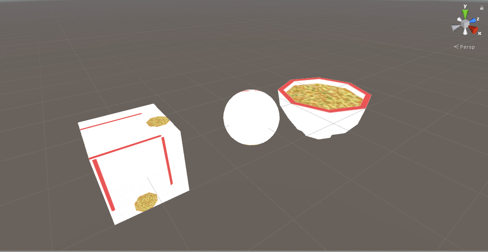

__Note: We can change how Textures in Unity are sampled by going back to the texture file and changing the filter mode in the inspector:__

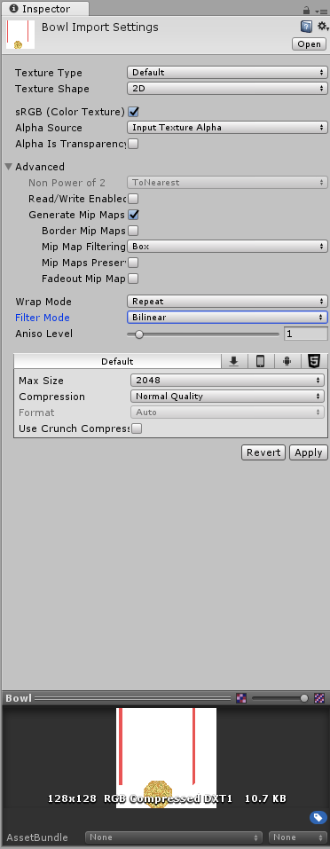
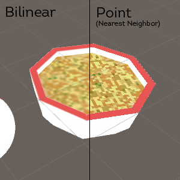

## Part 6: Playing With Shaders

So now that we know the basics, we can start having some fun with shaders and achieve some simple effects. First, we're going to use our noise texture and achieve a sort of "dissolve" or "cutout" effect. We'll start by adding a texture property and a float property:
```
Properties {
	_Colour ("Colour", Color) = (1, 1, 1, 1)
	_MainTexture ("Main Texture", 2D) = "white" {}
	_DissolveTexture ("Dissolve Texture", 2D) = "white" {}
	_DissolveCutoff ("Dissolve Cutoff", Range(0, 1)) = 1
}
```
Notice how we've set _DissolveCutoff to be a Range from (0, 1). This represents a float value from 0 to 1 (inclusive) and this notation also allows us to easily set it's value using a slider from within Unity's inspector. Now let's add them to our CGPROGRAM:
```
float4 _Colour;
sampler2D _MainTexture;
sampler2D _DissolveTexture;
float _DissolveCutoff;
```
Now we can sample the dissolve texture in our fragment function:
```
fixed4 fragmentFunction (v2f IN) : SV_TARGET {
	float4 textureColour = tex2D(_MainTexture, IN.uv);
	float4 dissolveColour = tex2D(_DissolveTexture, IN.uv);
	return textureColour;
}
```
Notice we're still using the same UV coordinates as our main texture.
Now here's where the magic happens:
```
fixed4 fragmentFunction (v2f IN) : SV_TARGET {
	float4 textureColour = tex2D(_MainTexture, IN.uv);
	float4 dissolveColour = tex2D(_DissolveTexture, IN.uv);
	clip(dissolveColour.rgb - _DissolveCutoff);
	return textureColour;
}
```
The *clip* function works by checking if the value given is less than 0. If it is, then we discard the pixel and draw nothing. If it isn't we keep the pixel and continue as normal. The way our code currently works is:

1. We sample the main texture for colour.
2. We sample the cutout texture for it's colour.
3. We subtract the cutoff value from the "brightness" of our cutoff sample, and...
4. If it's less than 0, we draw nothing
5. Otherwise, return the main texture sample colour.

Now, save your shader and return to Unity. Set the "Dissolve Texture" to our noise texture, and start moving the "Dissolve Cutoff" slider, you should see an effect like this:

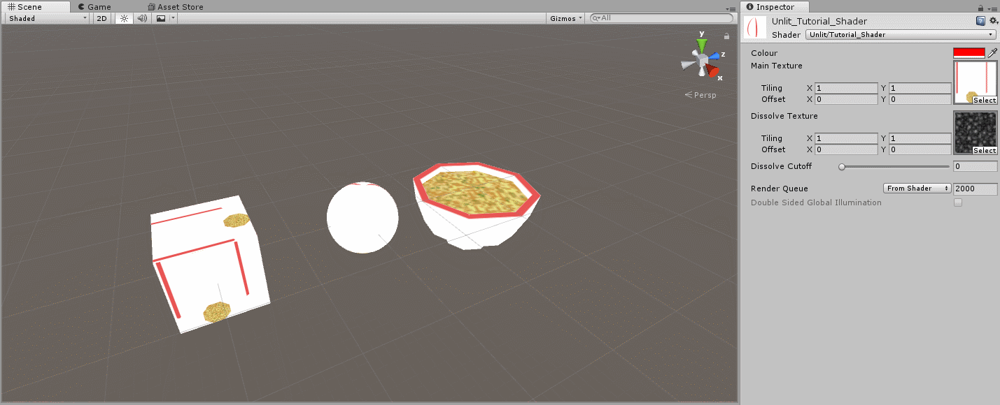

Pretty cool huh? We can do more too. Let's try playing with the vertices before we pass them to our fragment function. Let's expose another property:

```
Properties {
	_Colour ("Colour", Color) = (1, 1, 1, 1)
	_MainTexture ("Main Texture", 2D) = "white" {}
	_DissolveTexture ("Dissolve Texture", 2D) = "white" {}
	_DissolveCutoff ("Dissolve Cutoff", Range(0, 1)) = 1
	_ExtrudeAmount ("Extrue Amount", float) = 0
}

...

float4 _Colour;
sampler2D _MainTexture;
sampler2D _DissolveTexture;
float _DissolveCutoff;
float _ExtrudeAmount;
```
We're also going to using normals from the model, so lets add the field into the appdata struct so we can access them:
```
struct appdata {
	float4 vertex : POSITION;
	float2 uv : TEXCOORD0;
	float3 normal : NORMAL;
};
```
Now let's add a single line to our vertex function:
```
v2f vertexFunction (appdata IN) {
	v2f OUT;
	IN.vertex.xyz += IN.normal.xyz * _ExtrudeAmount;
	OUT.position = UnityObjectToClipPos(IN.vertex);
	OUT.uv = IN.uv;
	return OUT;
}
```
What we're doing here is, before we transform our vertices out of local model space, we're going to offset them a certain amount outwards by adding their normal direction times our _ExtrudeAmount. A normal is just a vector that represents the direction that the vertex is facing. Now if you save and return to Unity and play with the "Extrude Amount" value, you should see an effect like this:

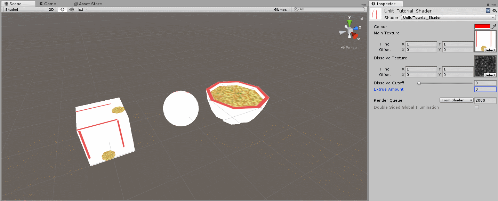

We can even animate these properties:

```
v2f vertexFunction (appdata IN) {
	v2f OUT;
	IN.vertex.xyz += IN.normal.xyz * _ExtrudeAmount * sin(_Time.y); // Note the use of sin(_Time.y)
	OUT.position = UnityObjectToClipPos(IN.vertex);
	OUT.uv = IN.uv;
	return OUT;
}
```
*_Time* is a variable included in *UnityCG.cginc* that represents the time, with the y value representing seconds.
Make sure "Animated Materials" is checked on in the scene view in order to preview this effect in the editor:

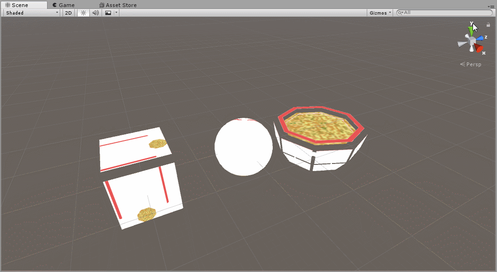

Here's our final shader:

```
Shader "Unlit/Tutorial_Shader" {
	Properties {
		_Colour ("Colour", Color) = (1, 1, 1, 1)
		_MainTexture ("Main Texture", 2D) = "white" {}
		_DissolveTexture ("Dissolve Texture", 2D) = "white" {}
		_DissolveCutoff ("Dissolve Cutoff", Range(0, 1)) = 1
		_ExtrudeAmount ("Extrue Amount", float) = 0
	}

	SubShader {
		Pass {
			CGPROGRAM
				#pragma vertex vertexFunction
				#pragma fragment fragmentFunction

				#include "UnityCG.cginc"

				struct appdata {
					float4 vertex : POSITION;
					float2 uv : TEXCOORD0;
					float3 normal : NORMAL;
				};

				struct v2f {
					float4 position : SV_POSITION;
					float2 uv : TEXCOORD0;
				};

				float4 _Colour;
				sampler2D _MainTexture;
				sampler2D _DissolveTexture;
				float _DissolveCutoff;
				float _ExtrudeAmount;

				v2f vertexFunction (appdata IN) {
					v2f OUT;
					IN.vertex.xyz += IN.normal.xyz * _ExtrudeAmount * sin(_Time.y);
					OUT.position = UnityObjectToClipPos(IN.vertex);
					OUT.uv = IN.uv;
					return OUT;
				}

				fixed4 fragmentFunction (v2f IN) : SV_TARGET {
					float4 textureColour = tex2D(_MainTexture, IN.uv);
					float4 dissolveColour = tex2D(_DissolveTexture, IN.uv);
					clip(dissolveColour.rgb - _DissolveCutoff);
					return textureColour;
				}
			ENDCG
		}
	}
}
```
*(If you want to see a commented version, go [here.](./Assets/Shaders/Tutorial_Shader.shader))*

## Part 7: Scripting and Shaders

Next, we'll talk about how to control shaders with Unity scripts. For this example, we'll reuse the _Colour property we added before. First, lets set it as a colour tint for our shader by doing this in our fragment function:

```
fixed4 fragmentFunction (v2f IN) : SV_TARGET {
	float4 textureColour = tex2D(_MainTexture, IN.uv);
	float4 dissolveColour = tex2D(_DissolveTexture, IN.uv);
	clip(dissolveColour.rgb - _DissolveCutoff);
	return textureColour * _Colour;
}
```
We're just multiplying the output colour by our _Colour property to tint it. Here's what that looks like in the editor:

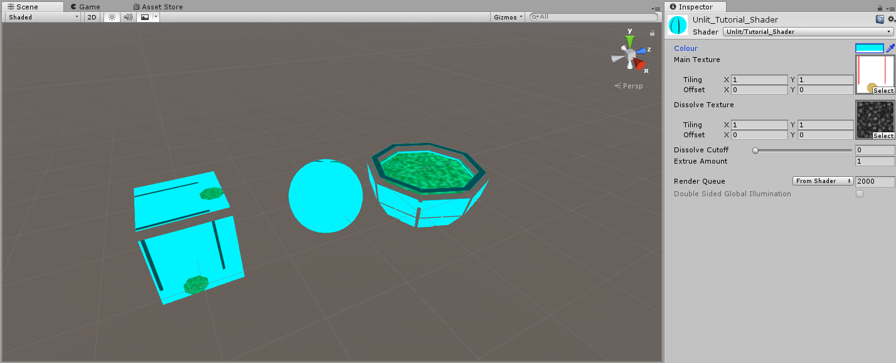

Alright, lets start scripting. We'll add a new script to all the objects and we'll call it *RainbowColour.cs*

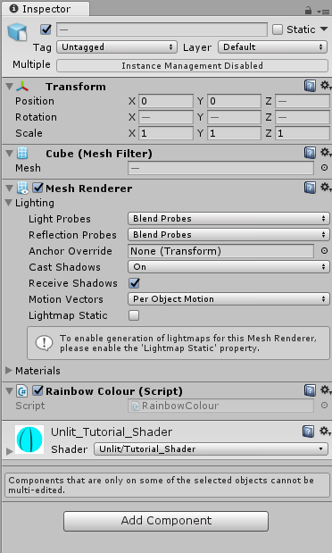

In our script, we'll start by declaring two private variables for our Renderer and our Material:

```csharp
using System.Collections;
using System.Collections.Generic;
using UnityEngine;

public class RainbowColour : MonoBehaviour {

	Renderer rend;
	Material material;

	void Start () {
		
	}
	
	void Update () {
		
	}
}
```

We'll also get references to them in our Start() function:
```csharp
void Start () {
	rend = GetComponent<Renderer>();
	material = rend.material;
}
```
We will use Material.SetColor(...) to set the colour in our shader. This function's first argument is a string, which is the name of the property we want to set. The second argument is the colour we want to set the property to.
```csharp
void Start () {
	rend = GetComponent<Renderer>();
	material = rend.material;
	material.SetColor("_Colour", Color.magenta);
}
```

Now notice when we start our game, the tint colour changes to magenta!

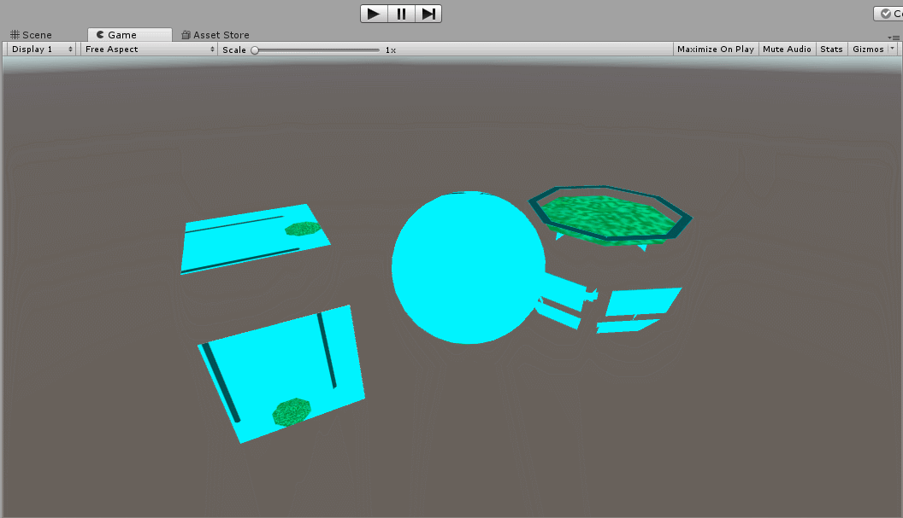

*(If you want to see a commented version of the script, go [here.](./Assets/Scripts/RainbowColour.cs))*

There are many functions for getting and setting properties for materials from within scripts, and you can find all of them [here.](https://docs.unity3d.com/ScriptReference/Material.html)

## Part 8: Shadows? Surface Shaders?

Up to this point, we've been writing *unlit* shaders. Unlit shaders don't consider lights or shadows. Unity also lets you write *surface* shaders. Surface shaders are actually just like vertex/fragment shaders except they strip away alot of the boilerplate code that is required to make shaders interact with lighting and shadows. If you're curious about going through that process of writing code for lighting and shadows, there is a great tutorial by Jasper Flick [here.](http://catlikecoding.com/unity/tutorials/rendering/part-4/)

What I'll show you in this section is how each part of the surface shader relates to our vertex/fragment shaders. If you create a new "Standard Surface Shader" from within Unity, you'll get this auto-generated code:

```
Shader "Custom/NewSurfaceShader" {
	Properties {
		_Color ("Color", Color) = (1,1,1,1)
		_MainTex ("Albedo (RGB)", 2D) = "white" {}
		_Glossiness ("Smoothness", Range(0,1)) = 0.5
		_Metallic ("Metallic", Range(0,1)) = 0.0
	}
	SubShader {
		Tags { "RenderType"="Opaque" }
		LOD 200
		
		CGPROGRAM
		// Physically based Standard lighting model, and enable shadows on all light types
		#pragma surface surf Standard fullforwardshadows

		// Use shader model 3.0 target, to get nicer looking lighting
		#pragma target 3.0

		sampler2D _MainTex;

		struct Input {
			float2 uv_MainTex;
		};

		half _Glossiness;
		half _Metallic;
		fixed4 _Color;

		// Add instancing support for this shader. You need to check 'Enable Instancing' on materials that use the shader.
		// See https://docs.unity3d.com/Manual/GPUInstancing.html for more information about instancing.
		// #pragma instancing_options assumeuniformscaling
		UNITY_INSTANCING_CBUFFER_START(Props)
			// put more per-instance properties here
		UNITY_INSTANCING_CBUFFER_END

		void surf (Input IN, inout SurfaceOutputStandard o) {
			// Albedo comes from a texture tinted by color
			fixed4 c = tex2D (_MainTex, IN.uv_MainTex) * _Color;
			o.Albedo = c.rgb;
			// Metallic and smoothness come from slider variables
			o.Metallic = _Metallic;
			o.Smoothness = _Glossiness;
			o.Alpha = c.a;
		}
		ENDCG
	}
	FallBack "Diffuse"
}
```

Let's go through each section that is new and explain what they do. First, the tags:
```
SubShader {
		Tags { "RenderType"="Opaque" }
		...
}
```
Tags help you tell the rendering engine how and when the shader you're writing is going to be rendered. You can learn more about tags [here.](https://docs.unity3d.com/Manual/SL-SubShaderTags.html) In this case, we're just specifying that our shader is opaque; Especially useful for producing a depth texture/map.

```
LOD 200
```
The shader Level of Detail or (LOD) helps specify which shader to use on certain hardware. The higher the LOD, the more "complex" the shader is. This value has nothing to do with model LOD. You can read more about shader LOD [here.](https://docs.unity3d.com/Manual/SL-ShaderLOD.html)
```
#pragma surface surf Standard fullforwardshadows
```
Similar to how we defined the vertex and fragment functions, we care defining here a surface function called surf. "Standard" tells Unity that this shader uses the standard lighting model, and "fullforwardshadows" specifies that this shader should enable all regular shadow types.
```
#pragma target 3.0
```
This tells which lighting version to compile. The higher the value, the more complex and better looking but the higher system requirements. You can read more about this [here.](https://docs.unity3d.com/Manual/SL-ShaderCompileTargets.html)
```
void surf (Input IN, inout SurfaceOutputStandard o) {
	// Albedo comes from a texture tinted by color
	fixed4 c = tex2D (_MainTex, IN.uv_MainTex) * _Color;
	o.Albedo = c.rgb;
	// Metallic and smoothness come from slider variables
	o.Metallic = _Metallic;
	o.Smoothness = _Glossiness;
	o.Alpha = c.a;
}
```
This is the heart of the shader. Instead of specifying exactly the colour value of the pixel, Unity defines a SurfaceOutputStandard structure. It has attributes such as Albedo (for colour) which you will set. Since we're working with lighting and shadows now, we don't just grab the colour directly, it needs to be calculated from values held in SurfaceOutputStandard. Here are all the attributes that are part of SurfaceOutputStandard:
```
struct SurfaceOutput
{
	fixed3 Albedo;  // diffuse color
	fixed3 Normal;  // tangent space normal, if written
	fixed3 Emission;
	half Specular;  // specular power in 0..1 range
	fixed Gloss;    // specular intensity
	fixed Alpha;    // alpha for transparencies
};
```

__Okay, so what about vertices?__

By default, the standard surface shader doesn't expose a function for editing vertices. We can still add one though. First, we'll add to the pragma and define a vertex function:
```
#pragma surface surf Standard fullforwardshadows vertex:vert
```
And also define the function:
```
void vert(inout appdata_full v){
	
}
```
The "appdata_full" structure will automatically be filled in by Unity with the attributes of the model we're rendering. This is the same as before, except instead of explicitly creating our own structure, Unity has already defined a few for us. You can see what other structures they have defined and what attributes will be passed in [here.](https://docs.unity3d.com/Manual/SL-VertexProgramInputs.html)

Now we can edit the vertices as normal. For example, to translate the code we had before:
```
void vert(inout appdata_full v){
	v.vertex.xyz += v.normal.xyz * _ExtrudeAmount * sin(_Time.y);
}
```

__Note: If you notice that when you update the vertices but the shadows are not also being updated, make sure to add the "addshadow" pragma like this:__

```
#pragma surface surf Standard fullforwardshadows vertex:vert addshadow
```

Surface shaders have alot going on within them and are much more complex, but they ultimately compile down to vertex and fragment functions just like the ones we were writing before. I highly suggest reading the official documentation [here](https://docs.unity3d.com/Manual/SL-SurfaceShaders.html) to learn more about them. The official documenation also has a great page of examples [here](https://docs.unity3d.com/Manual/SL-SurfaceShaderLightingExamples.html) which is a good place to start if you want to understand them better. Alan Zucconi also has a great tutorial introducing them available [here.](http://www.alanzucconi.com/2015/06/17/surface-shaders-in-unity3d/)

## Part 9: Other Shaders

So far we've talked about the *unlit* shader and the *surface* shader. Let's talk about the other types of shaders we can use in Unity.

The *Image Effect* shader is exactly as it sounds, it's a shader for image effects. More specifically, they tend to take a texture as their input and output a texture aswell. They can be applied to cameras in Unity or any other texture to affect their look before being outputted to the screen/framebuffer. As an exercise, try creating a new one in Unity and attempting to understand the code! They are great for doing things like the "CRT" effect, or a black and white effect. Dan John Moran has a great video tutorial available [here](https://www.youtube.com/watch?v=kpBnIAPtsj8) which introduces image effect shaders and how to create/use them. (His channel in general is a great place to start learning more about shaders!)

The *Compute* shader is a type of shader that is used for computing and calculating data. Remember how I said shaders run in the GPU? For some computational tasks, this can be extremely beneficial as they will run much faster in a parallel process. For example, they can be used to calculate physics, or the position of particles in a simulation. In general, most people will never need to touch compute shaders. If you'd like to learn more you can check out a tutorial by Kyle Halladay available [here.](http://kylehalladay.com/blog/tutorial/2014/06/27/Compute-Shaders-Are-Nifty.html) (Admittedly I don't know too much about compute shaders myself.)

## Part 10: Further Reading

Hopefully this tutorial has helped you in getting started on writing your own shaders, but there is still alot to learn! Shaders are a vital ingredient in helping shape how your game looks and performs. My suggestion is to keep experimenting and keep learning. (That doesn't just apply to shaders either!) If you see a neat or notable effect in a game, chances are shaders have a part in achieving it, so try your hand at replicating it. This section is dedicated in listing some resources that have been useful to me for learning about shaders.

* __[Unity Manual, Shader Reference](https://docs.unity3d.com/Manual/SL-Reference.html)__
	* [ShaderLab Syntax](https://docs.unity3d.com/Manual/SL-Shader.html)
	* [Built-in Shader Helper Functions](https://docs.unity3d.com/Manual/SL-BuiltinFunctions.html)
	* [Writing Vertex and Fragment Shaders](https://docs.unity3d.com/Manual/SL-ShaderPrograms.html)
	* [Vertex and Fragment Shader Examples](https://docs.unity3d.com/Manual/SL-VertexFragmentShaderExamples.html)
	* [Writing Surface Shaders](https://docs.unity3d.com/Manual/SL-SurfaceShaders.html)
	* [Surface Shader Examples](https://docs.unity3d.com/Manual/SL-SurfaceShaderLightingExamples.html)
* __[Nvidia Cg Documentation](http://developer.download.nvidia.com/cg/index_stdlib.html)__
* __[Catlike Coding's/Jasper Flick's Tutorials](http://catlikecoding.com/unity/tutorials/)__
* __[Alan Zucconi's Tutorials](http://www.alanzucconi.com/tutorials/)__
* __[Makin' Stuff Look Good in Video Games](https://www.youtube.com/channel/UCEklP9iLcpExB8vp_fWQseg)__
